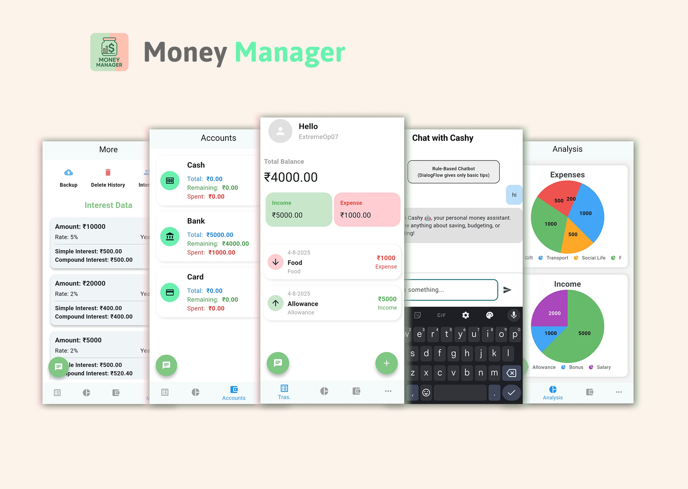

# Money Manager

**Money Manager** is a personal finance tracking mobile application built with **Flutter** that helps users take control of their finances. It provides tools for **expense categorization**, **budget planning**, and **summary analytics** to track spending habits and financial goals.

## 🚀 Features

- **Financial Dashboard** — Total balance, categorized expenses, and income summary
- **Expense Categorization** — Classify expenses like food, bills, entertainment, etc.
- **Budget Planning** — Set limits on spending categories
- **Summary Analytics** — Monthly breakdown of spending patterns
- **Cashy Chatbot** — Rule-based chatbot built with Dialogflow

